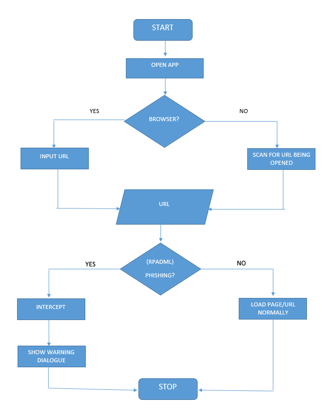

# rpad-ml
Real-time Phishing Attack Detection using ML 💻

The repo contains code for both the ML server and the Android app which was used to detect phishing sites in real-time.
Below is a flow chart of it.

